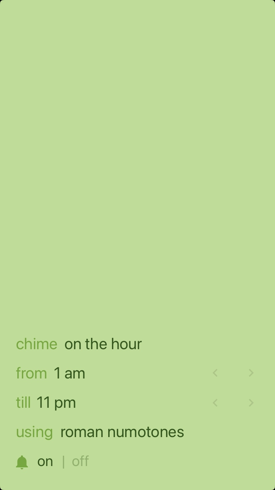

# Roman Numotones

Cuckoo with roman numerals

## History

Sooo... there was this super minimalist awesome app called [Chime (this link is broken)](https://apps.apple.com/us/app/id414830146) [(so is this)](http://itunes.apple.com/app/chime/id414830146)

It used to play sounds on the hour, every half hour, every quarter hour, or just before the hour within the time range you'd want it to using **roman numotones**, musical chords, speech, or beeps

And that's it! Simple hun?!

## Roman Numotones

### WTF?!

Are you familiar with small towns, with old central churches that ring bells around o'clock?

11am?! Sure, take those 11 dings folks

Roman Numotones are that... on steroids

### How?

1. Take the hour, make it to roman numerals

|     |      |
| --: | :--: |
|   1 |  I   |
|   2 |  II  |
|   3 | III  |
|   4 |  IV  |
|   5 |  V   |
|   6 |  VI  |
|   7 | VII  |
|   8 | VIII |
|   9 |  IX  |
|  10 |  X   |
|  11 |  XI  |
|  12 | XII  |

2. Assign each letter to a sound

|     | ABC | DoReMi | Frequency |
| :-: | :-: | :----: | :-------: |
|  I  | D 5 |  Ré 5  |  587 Hz   |
|  V  | B 4 |  Si 4  |  494 Hz   |
|  X  | G 4 | Sol 4  |  392 Hz   |

Done

11 o'clock? Don't worry bro, take those 2 dings

# ONLY 2 f\*\*\*ing DINGS!!!

Do not believe me?

[Try it out](./out) you'll see how much sense it makes

Too bad the app won't work anymore, it was bliss!

Someday - when I finally buy myself a MacBook - I'll make an app to replace Chime (RIP buddy you served us well)

By now I'll just [remake](./hz.ipynb) those gorgeous numotones with ULTRA HIGH QUALITY based on the **original sounds** you can find [here (Chime's source code)](https://github.com/alcor/blacktree-chime) and [locally copied here](./blacktree-chime-original-caf)

### App random infos

Release date: 2011-01-24

Last updated: 2015-07-08

Rating: 5/5 (255)

Size: 9Mb
